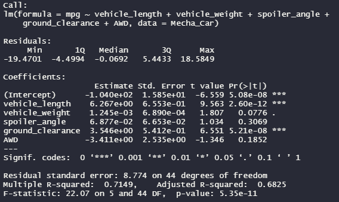

# MechaCar_Statistical_Analysis

## Linear Regression to Predict MPG

Which variables/coefficients provided a non-random amount of variance to the mpg values in the dataset?
- Both vehicle length and ground clearance have no impact on gas mileage. 

Is the slope of the linear model considered to be zero? Why or why not?
- No, it is not considered zero, the p-value is smaller than 0.05.

Does this linear model predict mpg of MechaCar prototypes effectively? Why or why not?
- Since the Adjusted R-squared is 0.6825, that means these variables explain 68.25% of the gas mileage. However it would be best to disregard the other three variables because their individual p-values are disqualifying.

## Summary Statistics on Suspension Coils

The design specifications for the MechaCar suspension coils dictate that the variance of the suspension coils must not exceed 100 pounds per square inch. Does the current manufacturing data meet this design specification for all manufacturing lots in total and each lot individually? Why or why not?

### Total

- Yes, the manufacturing data meets the design specification for all manufacturing lots total with the variance of 62.29, which is below the 100 PSI.

### Individual

- Both Lots 1 and 2 are below the 100 PSI for the variance specification.
- However, Lot 3 far exceeds the maximum of 100PSI with a total of 170.29 PSI.

## T-Tests on Suspension Coils

### Total Summary

- This is not statistically different as the p-value is only 0.06. This indicates weak evidence against the null hypothesis.

### Individual Summaries

- Both Lot 1 and Lot 2 are significant since they are higher than the 0.05. We fail to reject the null hypothesis.
- Lot 3 is not statistically significant with 0.04. Therefore we reject the null hypothesis.

## Study Design: MechaCar vs Competition

What metric or metrics are you going to test?
- We can measure the MechaCar against other manufacturers with cost, city or highway fuel efficiency, horse power, maintenance cost, or safety rating.
- The maintenance cost would be one of the biggest factors for consumers as they do not want to constantly spend money on the upkeep of their vehicles.

What is the null hypothesis or alternative hypothesis?
- The null hypothesis would be no significant difference between MechCar's maintenance costs and other manufacturer's maintenance costs.

What statistical test would you use to test the hypothesis? And why?
- We can use a t-test to determine whether there is significant average monthly/annual costs for maintaining the vehicles.

What data is needed to run the statistical test?
- We would need average cost of maintaining the vehicle in working drivable condition, whether it would be on a monthly cost, annual cost, or even repairs due to accidents.

